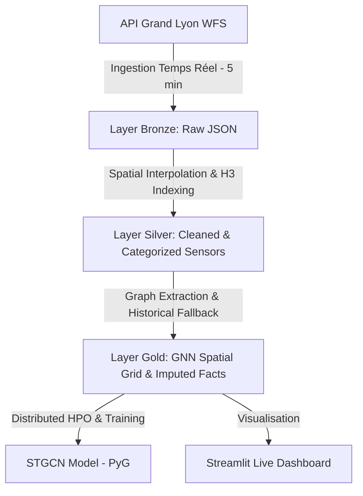

# 🟢 LyonFlow : Spatio-Temporal Traffic Prediction Platform (Grand Lyon)

[](https://www.python.org/)
[](https://pytorch.org/)
[](https://airflow.apache.org/)
[](https://www.ray.io/)
[](https://optuna.org/)
[](https://www.postgresql.org/)
[](https://www.docker.com/)

**LyonFlow** est une plateforme MLOps de bout en bout conçue pour ingérer, transformer, modéliser et prédire en temps réel l'état du trafic routier de la Métropole de Lyon. Ce projet d'architecture IA combine un pipeline de données  géospatiales et un modèle de Deep Learning géométrique avancé.

---

## 🗺️ Architecture de Données (Médaillon)

La plateforme repose sur une architecture de stockage structurée en trois couches dans **PostgreSQL** :



1. **Layer Bronze (`bronze.trafic_vitesse_brute`)** : Ingestion brute au format JSONB du flux WFS de la Métropole de Lyon toutes les 5 minutes via Airflow.
2. **Layer Silver (`silver.trafic_vitesse_propre`)** :
   * Nettoyage spatial et géospatial (EPSG:2154 Lambert-93 vers EPSG:4326 WGS84).
   * Interpolation des segments de route tous les **7 mètres** pour générer des coordonnées précises.
   * Indexation spatiale à l'aide de cellules **H3 (Résolution 13)**.
   * Normalisation et catégorisation des vitesses en temps réel.
3. **Layer Gold (`gold`) & Fichiers Plats (Parquet/CSV)** :
   * `dim_spatial_grid_mapping` : Alignement des capteurs géographiques sur une grille relative $(i, j)$ constante (chargé via `node_mapping.csv`).
   * `dim_gnn_adjacency` : Construction dynamique de la matrice d'adjacence du graphe routier (chargé via `edges.csv`).
   * `fact_traffic_series` : Table temporelle de faits de vitesse interpolée et imputée (chargé via `traffic_series.csv`).
   * **Vue Matérialisée (`mv_fact_traffic_pivot`)** : Pivot spatio-temporel rafraîchi après chaque import, servant de source d'inférence en temps réel pour Streamlit.
   * **Sauvegardes Parquet (`data/processed/`)** : Export compressé haute performance des séries de trafic pour un entraînement ML "hors-ligne" optimisé (Ray charge directement ces fichiers plats, libérant ainsi les verrous et la bande passante de la base PostgreSQL).

---

## 🧠 Pourquoi ce choix technologique ? (STGCN + Ray + Optuna)

Pour résoudre le défi de la prédiction du trafic, une simple approche par séries temporelles classiques (LSTM, Prophet) ou par apprentissage tabulaire (XGBoost) est insuffisante car **le trafic routier est intrinsèquement spatio-temporel**.

### 1. Architecture du Modèle : Spatio-Temporal GRU-GNN (ST-GRU-GNN)
> [!IMPORTANT]
> **Clarification Architecturale (Honnêteté Scientifique) :**
> Notre implémentation dans `model.py` différe de la structure STGCN originale proposée par Yu et al. (2018). Alors que l'article original préconise des convolutions temporelles causales 1D (Gated CNNs avec GLU), nous implémentons un modèle hybride récurrent-spatial : **GRU + GCN avec Skip Connections** (que nous désignons sous le nom de **ST-GRU-GNN**). Bien que le nom de classe `SpatioTemporalGCN` et les scripts conservent par simplicité le préfixe `stgcn`, l'architecture récurrente est ici privilégiée pour sa robustesse face au bruit et à l'échantillonnage irrégulier du flux réel de la Métropole de Lyon.

Le trafic dépend à la fois de son propre historique (temporel) et du trafic des rues adjacentes qui s'y déverse (spatial) :
* **Composante Temporelle (Temporal GRU Encoder) :** Utilise un réseau récurrent **GRU (Gated Recurrent Unit)** pour modéliser les dépendances temporelles séquentielles de vitesse sur chaque nœud du graphe. Cela capte efficacement les dynamiques temporelles à court terme sans souffrir des limitations des convolutions causales sur des séries réelles bruitées.
* **Composante Spatiale (Spatial GNN Decoder) :** Utilise deux couches de convolutions spectrales de graphes (`GCNConv` de PyTorch Geometric) sur la matrice d'adjacence du réseau routier pour propager l'influence physique des flux entre segments adjacents.
* **Sauts de Connexion (Residual Skip Connections) :** Des connexions résiduelles relient les étapes de convolution spatiale pour stabiliser le calcul des gradients lors de la backpropagation.
* **Framework :** Écrit sous **PyTorch Geometric (PyG)**.

### 2. Moteur : Ray Cluster (Apprentissage Distribué)
L'entraînement d'un modèle de Deep Learning sur des graphes (GNN) est extrêmement gourmand en ressources de calcul.
* **Gestion des ressources locales :** Ray permet de brider strictement l'usage CPU/GPU (ex. allocation stricte de 1 CPU et du GPU T600) via Docker pour éviter toute surchauffe ou blocage de la machine hôte.
* **Évolutivité (Scale-out) :** Ray abstrait l'infrastructure. Le même code d'entraînement s'exécute de manière transparente sur en local ou sur un cluster Kubernetes de plusieurs nœuds dans le Cloud, sans modification.
* **Parallélisme :** Les trials d'optimisation s'exécutent en parallèle, gérant dynamiquement la file d'attente sur les ressources partagées.

### 3. Optimiseur : Optuna (Bayesian Hyperparameter Tuning)
Le comportement de STGCN est hautement sensible à ses hyperparamètres (nombre de canaux cachés, taille de la fenêtre temporelle d'entrée, taux d'apprentissage, et pondérations spécifiques pour pénaliser les ralentissements et embouteillages).
* **Optimisation Bayésienne (TPE Sampler) :** Contrairement à une recherche aléatoire (Random Search) ou sur grille (Grid Search), Optuna construit un modèle probabiliste des performances pour échantillonner intelligemment les meilleurs jeux de paramètres futurs.
* **Élimination Précoce (Pruning) :** Grâce au pruner d'Optuna (MedianPruner), les trials qui affichent des performances initiales médiocres après quelques époques sont arrêtés immédiatement. Cela a permis d'accélérer notre recherche d'un **facteur de x5.3** (20 trials terminés avec succès en seulement 8 minutes sur machine locale !).

---

## Stack Technologique & Écosystème MLOps

La plateforme orchestre plusieurs conteneurs isolés via Docker Compose :

* **Orchestrateur (Apache Airflow) :** Gère le déclenchement périodique de l'ingestion brute (Bronze), de la transformation spatiale (Silver) et de la matérialisation du graphe (Gold).
* **Moteur d'Expérimentation (MLflow) :** Enregistre automatiquement chaque trial d'optimisation d'Optuna (paramètres, métriques de perte d'entraînement/validation, et artéfacts du modèle).
* **Visualiseur HPO (Optuna Dashboard) :** Dashboard web complet dédié à l'étude d'hyperparamètres, affichant les analyses d'importance des paramètres, les coordonnées parallèles et les courbes de convergence.
* **Interface Utilisateur (Streamlit) :** Une application interactive permettant aux décideurs d'observer l'état du réseau routier et d'accéder aux prévisions en temps réel.


---

## Guide de Démarrage Rapide

### 1. Lancement de la plateforme MLOps
Assurez-vous que Docker Desktop (avec backend WSL2) est démarré, puis exécutez à la racine du projet :
```powershell
docker-compose up -d --build
```

### 2. Accéder aux différents services

| Service | URL locale | Description |
| :--- | :--- | :--- |
| **📊 Streamlit App** | [http://localhost:8501](http://localhost:8501) | Dashboard trafic en temps réel |
| **🧪 MLflow Tracking** | [http://localhost:5000](http://localhost:5000) | Suivi des entraînements et des modèles |
| **⚙️ Apache Airflow** | [http://localhost:8080](http://localhost:8080) | Interface d'administration des pipelines |
| **📈 Optuna Dashboard** | [http://localhost:8085](http://localhost:8085) | Visualisation bayésienne des hyperparamètres |
| **⚡ Ray Dashboard** | [http://localhost:8265](http://localhost:8265) | Monitoring du cluster de calcul distribué |

### 3. Exécuter l'entraînement du modèle (Ray Cluster)
L'entraînement de notre modèle ST-GRU-GNN consomme directement les exports csv générés lors de l'étape d'ingestion historique, éliminant ainsi les goulots d'étranglement réseau de la base de données.

Pour lancer l'entraînement optimisé :
```powershell
docker exec -it lyonflow-ray-head python /home/ray/project/training/stgcn/train_stgcn.py
```
*(Remarque : Vous pouvez également exécuter l'entraînement directement sur le conteneur `lyonflow-ray-worker` selon vos allocations de calcul).*

### 3. 🔐 Gestion des Connexions et Authentification (Sécurité)
Pour garantir la robustesse et la sécurité des données, il est crucial de faire la distinction entre les différents types d'identifiants utilisés dans la plateforme LyonFlow :

* **Identifiants de l'Interface Web d'Airflow** (Port `8080`) :
  * Utilisés pour s'authentifier sur le panel d'administration Web d'Airflow.
  * Valeurs par défaut : `xxx` / `yyyyyyy` (configurables dans le `.env` sous `AIRFLOW_ADMIN_USER` / `AIRFLOW_ADMIN_PASSWORD`).
* **Identifiants de la Base de Données PostgreSQL** (Port `5432`) :
  * Utilisés pour la connexion physique et la lecture/écriture des flux de données.
  * Valeurs par défaut : `zzzzz` / `zzzzzzzzzzzz` (configurables dans le `.env` sous `POSTGRES_USER` / `POSTGRES_PASSWORD`).

> [!WARNING]
> **Connexion `postgres_default` dans Airflow :**
> La connexion `postgres_default` d'Airflow est utilisée par les pipelines de données et par les jobs Ray (comme `monitoring_evidently.py`) pour interroger la base de données.
> Elle **doit impérativement** être configurée avec les identifiants PostgreSQL (`zzzzz` / `zzzzzzzzzzzz`), et **non** les identifiants d'administration Airflow (`xxx` / `yyyyyyy`). Une mauvaise configuration entraînera une erreur `FATAL: password authentication failed`.

#### Commande de configuration de la connexion `postgres_default` :
Si vous devez réinitialiser ou recréer cette connexion, exécutez la commande suivante à la racine :
```powershell
# Suppression de l'ancienne connexion incorrecte (si existante)
docker exec lyonflow-airflow-scheduler airflow connections delete postgres_default

# Création de la connexion correcte
docker exec lyonflow-airflow-scheduler airflow connections add postgres_default `
  --conn-type postgres `
  --conn-host postgres `
  --conn-login zzzzz `
  --conn-password zzzzzzzzzzzz `
  --conn-port 5432 `
  --conn-schema lyonflow
```