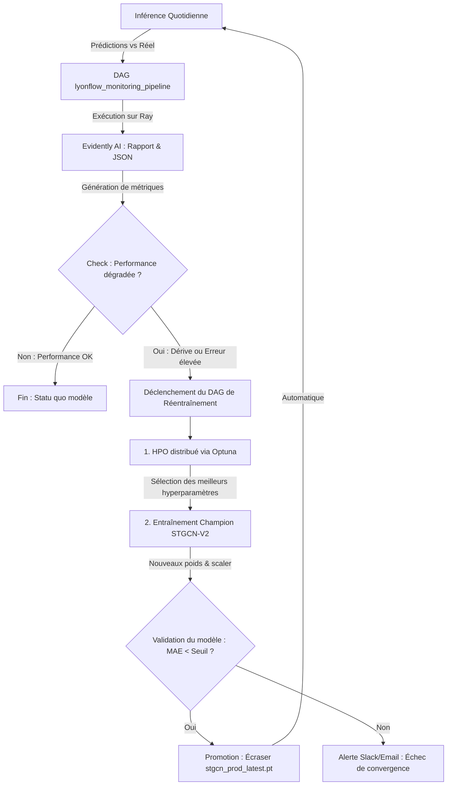

# 📈 Architecture & Recommandations : Réentraînement Conditionnel LyonFlow

Ce document formalise les spécifications techniques, la comparaison des modèles, la commande d'entraînement distribué sur GPU et la conception du DAG de réentraînement conditionnel pour la plateforme de prédiction du trafic lyonnais, **LyonFlow**.

---

## 🗺️ Vision Globale du Pipeline : "Self-Healing Pipeline"

Le pipeline s'articule autour d'une boucle fermée de rétroaction (closed-loop) entre l'observabilité quotidienne et le réentraînement automatique sur GPU :



---

## ⚖️ 1. Comparatif des Architectures : STGCN (V1) vs STGCN-V2

L'évolution de STGCN vers STGCN-V2 apporte des gains majeurs en termes de convergence, de performance d'entraînement et d'intégration de données.

| Caractéristique | STGCN (V1) | STGCN-V2 (Recommandé) |
| :--- | :--- | :--- |
| **Optimiseur** | `Adam` (classique) | `AdamW` (L2 regularization / weight decay découplée) |
| **Régularisation** | Basique | Améliorée (évite le surapprentissage sur les topologies complexes) |
| **Source de Données** | SQL dynamique (jointures on-the-fly) | Tables Gold pré-calculées (`gold.mv_fact_traffic_pivot`) |
| **Mode d'Entraînement** | CPU-first / Mono-GPU | Distribué sur cluster Ray (Multi-GPU ready) |
| **Stabilité** | Sujet à des sauts de gradient | Gradient clipping et scheduler de learning rate intégrés |

### Pourquoi STGCN-V2 est supérieur :
1. **Régularisation avec AdamW** : En découplant la pénalité L2 des mises à jour basées sur le gradient, `AdamW` permet au modèle d'apprendre des représentations spatiales et temporelles du trafic beaucoup plus robustes, évitant que certains arcs routiers dominent le processus de décision.
2. **Optimisation des flux de données** : STGCN-V2 élimine les requêtes de pivot SQL massives et répétitives en s'appuyant sur des vues matérialisées Gold, accélérant la préparation des tenseurs spatio-temporels de plusieurs ordres de grandeur.

---

## 🚀 2. Commande de Réentraînement sur le Cluster Ray (GPU)

Pour lancer le réentraînement de **STGCN-V2** sur le worker GPU de notre cluster Ray en utilisant les fichiers plats locaux et en injectant dynamiquement les meilleurs hyperparamètres (issus du HPO Optuna), la commande exacte à exécuter est la suivante :

```bash
docker exec -it -w /home/ray/project lyonflow-ray-worker bash -c "export USE_LOCAL_CSV=true DATA_FOLDER=/home/ray/project/data/in HORIZONS=6,12,36 EPOCHS=100 && source <(python training/stgcn/get_best_params.py) && python training/stgcn/train_stgcn_v2.py"
```

### 🔍 Décryptage de la commande :
*   `docker exec -it -w /home/ray/project lyonflow-ray-worker` : Exécute la commande de manière interactive au sein du container worker. C'est ce nœud spécifique qui dispose des drivers CUDA et de l'accès direct aux GPU de calcul, contrairement au conteneur `ray-head` qui est restreint au CPU.
*   `USE_LOCAL_CSV=true` et `DATA_FOLDER` : Force le script à utiliser les fichiers plats préalablement préparés (ex: `edges.csv`, `node_mapping.csv`, `traffic_series.csv`), évitant de surcharger la base de données PostgreSQL transactionnelle.
*   `source <(python training/stgcn/get_best_params.py)` : **Étape clé.** Ce script interroge l'étude Optuna en base et génère à la volée des déclarations `export KEY=VALUE` (ex: `LEARNING_RATE=0.001`, `BATCH_SIZE=32`, `SEQ_LEN=120`, `HIDDEN_CHANNELS=128`). Le `source` les injecte instantanément dans l'environnement du shell courant.
*   `train_stgcn_v2.py` : Entraîne le modèle STGCN-V2 sur GPU avec ces variables d'environnement configurées au plus juste.

---

## 🛠️ 3. Planification du DAG Airflow Conditionnel

Pour automatiser cette boucle fermée sans intervention humaine constante, le DAG Airflow `lyonflow_triggered_retraining` doit s'exécuter immédiatement après le DAG quotidien de monitoring.

### Étape 1 : Analyse des métriques d'erreur et de dérive (Gatekeeper)
Un `BranchPythonOperator` analyse le fichier de métriques de la matinée (`monitoring_metrics_morning.json`) généré par Evidently AI.

> [!IMPORTANT]
> **Critères de déclenchement du réentraînement :**
> 1. **Data Drift** : Si la p-value du test de dérive sur la vitesse réelle observée (`actual_speed`) est inférieure à **0.05** (dérive statistiquement significative).
> 2. **Performance Drift (Absolu)** : Si la MAE moyenne sur la tranche 7h-10h dépasse **5.0 km/h**.
> 3. **Performance Drift (Relatif)** : Si la MAE du jour dépasse de plus de **15%** celle du jour précédent.

```python
# Exemple de branchement logique conceptuel dans Airflow
def evaluate_drift_and_performance(**kwargs):
    import json
    with open('/home/ray/project/data/out/monitoring_metrics_morning.json', 'r') as f:
        metrics = json.load(f)
    
    p_value = metrics.get("data_drift_p_value", 1.0)
    mae_today = metrics.get("mae", 0.0)
    mae_yesterday = kwargs['ti'].xcom_pull(task_ids='get_yesterday_mae', key='yesterday_mae') or 4.0
    
    if p_value < 0.05 or mae_today > 5.0 or mae_today > (mae_yesterday * 1.15):
        return "trigger_gpu_retraining"
    return "skip_retraining"
```

### Étape 2 : Lancement distribué Ray & Récupération des Poids
Si la branche de réentraînement est choisie :
1. L'opérateur Airflow (ex: `DockerOperator` ou `SSHOperator`) déclenche la commande d'entraînement distribué sur le worker GPU Ray.
2. Le modèle est sauvegardé localement sous le nom `stgcn_v2_latest.pt` et le scaler sous `stgcn_v2_scaler.pkl`.

### Étape 3 : Validation de Sécurité (Post-Training Evaluation)
Avant d'envoyer le modèle en production, une tâche de validation compare la MAE du nouveau modèle sur un set de validation indépendant.
*   **Si MAE < Seuil** : Le modèle est déclaré apte.
*   **Sinon** : Le réentraînement est avorté pour éviter toute régression de performance en production, et une alerte Slack/Email est émise pour examen par l'équipe Data Science.

---

## 🔄 4. Promotion à Chaud (Zero Downtime)

Pour garantir une transition fluide et transparente pour l'utilisateur final et l'API d'inférence en temps réel :

1. Les processus d'inférence (`predict_stgcn.py`) et l'application Streamlit pointent vers des fichiers aux noms standardisés et immuables :
   *   `models/stgcn_prod_latest.pt`
   *   `models/stgcn_scaler.pkl`
2. La tâche de promotion d'Airflow réalise un remplacement atomique ("à chaud") sur le disque :
   ```bash
   cp models/stgcn_v2_latest.pt models/stgcn_prod_latest.pt
   cp models/stgcn_v2_scaler.pkl models/stgcn_scaler.pkl
   ```
3. Au prochain appel de l'API d'inférence (toutes les 5 minutes), le script recharge automatiquement les nouveaux poids à la volée.

---

## 📈 Bénéfices Clés de l'Architecture
*   **MLOps Maturité Niveau 2** : Passage d'un déploiement manuel à un pipeline auto-adaptatif capable de corriger ses propres dérives.
*   **Efficacité Énergétique (Green Computing)** : Les calculs lourds sur GPU ne sont lancés que lorsque c'est strictement nécessaire, optimisant l'usage de notre cluster Ray.
*   **Continuité de Service** : Pas de redémarrage de serveur ni d'interruption lors de la mise à jour des poids du modèle de Deep Learning.
