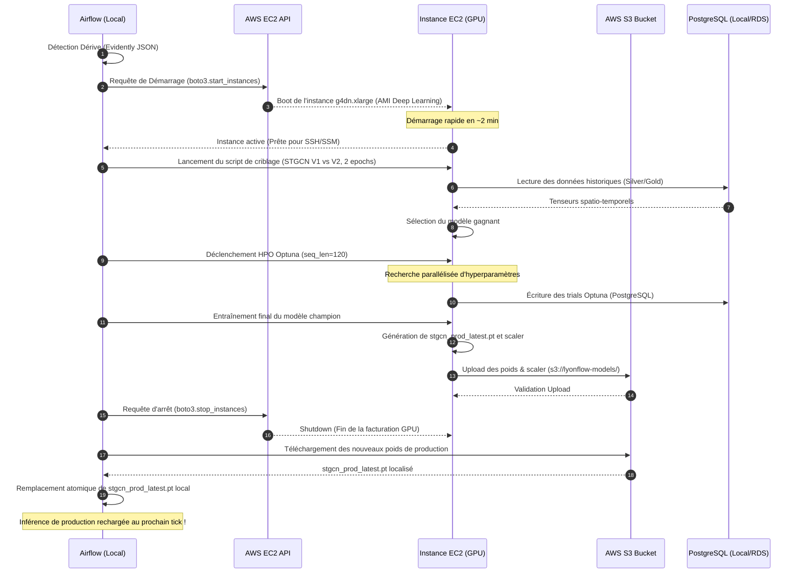
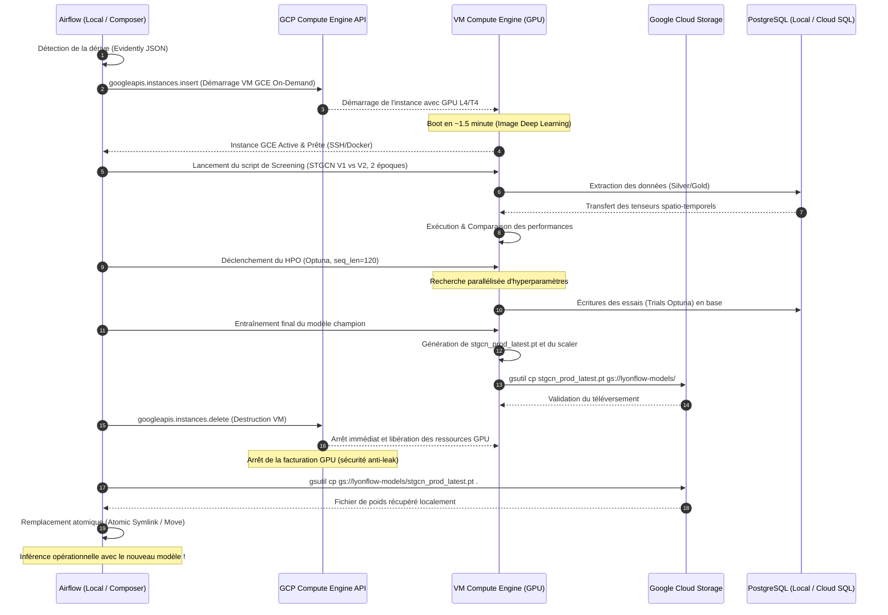

# 📈 Spécifications Techniques : Réentraînement Conditionnel & Modélisation de Coexistence des DAGs (LyonFlow)

Ce document décrit en détail l'architecture, la modélisation des cycles de vie et la stratégie de coexistence de deux flux critiques de LyonFlow :
1. **`lyonflow_traffic_pipeline`** : Le pipeline d'inférence en temps réel (s'exécutant toutes les 5 minutes).
2. **`lyonflow_monitoring_pipeline`** (et le déclencheur de réentraînement associé) : Le pipeline quotidien d'évaluation d'erreur et de dérive (s'exécutant à 11h00), pouvant lancer un réentraînement lourd sur le cluster de calcul.

---

## 🗺️ Vision Globale du Pipeline : "Self-Healing Loop"

Le pipeline s'articule autour d'une boucle fermée de rétroaction (closed-loop) entre l'observabilité quotidienne et le réentraînement automatique sur le cluster GPU Ray :

```mermaid
graph TD
    %% Cycle de Monitoring (DAG existant)
    A[Inférence Courante (Toutes les 5 min)] -->|Prédictions vs Réel| B[DAG lyonflow_monitoring_pipeline]
    B -->|Exécution sur Ray| C[Evidently AI : Rapport & JSON]
    
    %% Évaluation de la dégradation
    C -->|Génération de métriques| D{Check : Performance dégradée ?}
    
    %% Branchement Airflow
    D -->|Non| E[Fin : Statu quo modèle]
    D -->|Oui : Dérive ou Erreur élevée| F[Déclenchement du Réentraînement]
    
    %% Phase de Réentraînement (GPU sur Ray)
    F --> G[1. Phase de Criblage Rapide <br> STGCN V1 vs V2 <br> 2 époques - seq_len=120]
    G -->|Choix du meilleur modèle| H[2. HPO distribué via Optuna <br> seq_len=120]
    H -->|Sélection des meilleurs hyperparamètres| I[3. Entraînement Final Champion <br> seq_len=120]
    I -->|Nouveaux poids & scaler| J{Validation du modèle : MAE < Seuil ?}
    
    %% Promotion
    J -->|Oui| K[Promotion Atomique <br> Symlink / Remplacement à chaud]
    J -->|Non| L[Alerte Slack : Échec de convergence]
    
    %% Retour à l'inférence
    K -->|Automatique au prochain tick| A
```

---

## ⚖️ 1. Les Phases Détaillées du Réentraînement

Lorsqu'une dégradation est détectée, le processus de réentraînement s'organise en 3 phases rigoureuses :

1. **Phase 1 : Évaluation & Criblage Rapide (Screening)**
   * **Objectif** : Comparer rapidement les deux architectures concurrentes (**STGCN V1** et **STGCN-V2**) sur les données récentes.
   * **Méthodologie** : Entraînement des deux modèles sur seulement **2 époques** avec un historique étendu à **`seq_len = 120`** (10 heures de contexte routier pour mieux appréhender les congestions longues).
   * **Critère** : Sélection du modèle obtenant la plus faible MAE de validation (valeur transmise via XCom).

2. **Phase 2 : Optimisation des Hyperparamètres (HPO)**
   * **Objectif** : Trouver les hyperparamètres idéaux pour l'architecture gagnante de la Phase 1.
   * **Méthodologie** : Lancement d'une étude Optuna distribuée sur le cluster Ray, en maintenant la contrainte **`seq_len = 120`**.
   * **Variables recherchées** : Taux d'apprentissage (`lr`), taille de batch, canaux cachés, régularisation `weight_decay`.

3. **Phase 3 : Entraînement Final de Convergence**
   * **Objectif** : Obtenir les poids définitifs du modèle champion optimisé.
   * **Méthodologie** : Entraînement complet (ex: 50 à 100 époques) avec les hyperparamètres identifiés, toujours sur **`seq_len = 120`**.

---

## ⚡ 2. Modélisation de Coexistence : Impacts & Résolution des Conflits

Le lancement d'un entraînement de Deep Learning lourd sur le cluster de calcul peut sérieusement interférer avec le pipeline de production `lyonflow_traffic_pipeline` qui doit s'exécuter de façon fiable **toutes les 5 minutes**. 

Voici l'analyse des risques d'interférence et les solutions d'ingénierie implémentées :

### Risque A : Famine des Ressources (CPU/GPU Starvation)
* **Problème** : L'entraînement final et le HPO Optuna consomment énormément de ressources de calcul (CPU et GPU). Si Ray alloue 100% de la puissance au réentraînement, la tâche d'inférence de 5 minutes de `lyonflow_traffic_pipeline` va être mise en attente (starvation) et va rater son tick de production.
* **Résolution** : **Allocation asymétrique des ressources de Ray**.
  * Les tâches d'inférence de `lyonflow_traffic_pipeline` sont configurées pour être ultra-prioritaires et consomment uniquement du CPU (l'inférence STGCN sur ~700 segments prend moins de 5 secondes sur CPU).
  * Les tâches d'entraînement de Ray sont bridées en limitant la concurrence ou en exigeant une ressource personnalisée. Par exemple, l'entraînement s'exécute sur le worker GPU avec `@ray.remote(num_gpus=0.9)`, garantissant qu'il reste toujours de la marge CPU/GPU sur le cluster pour l'inférence.

### Risque B : Concurrence d'Accès aux Fichiers de Poids (File Read/Write Lock)
* **Problème** : Toutes les 5 minutes, `predict_stgcn.py` charge en mémoire le fichier `models/stgcn_prod_latest.pt`. Si la tâche de promotion du réentraînement écrase ce fichier exactement au même moment, Python va lever une exception de lecture (fichier corrompu ou incomplet) et l'inférence va planter.
* **Résolution** : **Remplacement atomique (Atomic Symlink / Move)**.
  * Au lieu de faire un `cp` direct qui prend du temps, le script d'entraînement écrit son résultat dans un fichier unique horodaté (ex: `models/stgcn_prod_20260603_2100.pt`).
  * La promotion s'effectue via un renommage atomique au niveau du système d'exploitation ou via un lien symbolique (symlink) mis à jour de manière atomique :
    ```bash
    # Création du lien symbolique de façon atomique
    ln -sf models/stgcn_prod_20260603_2100.pt models/stgcn_prod_latest.pt.tmp
    mv -f models/stgcn_prod_latest.pt.tmp models/stgcn_prod_latest.pt
    ```
  * L'appel système `mv` est instantané et atomique sur Unix/Linux. L'inférence lira soit l'ancienne version, soit la nouvelle, mais ne subira jamais de lecture partielle.

### Risque C : Concurrence sur la Base de Données (PostgreSQL Locks)
* **Problème** : Optuna effectue des centaines d'écritures rapides en base pendant le HPO pour journaliser les essais (trials). En parallèle, `lyonflow_traffic_pipeline` écrit les nouvelles prédictions du trafic en base toutes les 5 minutes.
* **Résolution** : 
  * Utilisation d'un pool de connexions (`psycopg2.pool`) robuste.
  * Séparation des schémas SQL : les tables de trafic de production appartiennent au schéma `gold`/`silver`, tandis qu'Optuna utilise ses propres tables dédiées d'historique de recherche, évitant tout verrouillage de table (Table Lock).

### Risque D : Multiples Réentraînements Concurrents (Drift in the middle of Training)
* **Problème** : Un entraînement complet sur `seq_len = 120` peut prendre entre 30 minutes et 2 heures. Si un deuxième cycle de monitoring quotidien s'exécute pendant ce temps, il risque de redéclencher un autre réentraînement concurrent, surchargeant le cluster.
* **Résolution** : **Limitation de concurrence sur Airflow**.
  * Le DAG de réentraînement est configuré avec `max_active_runs=1` et `catchup=False`.
  * Si un run de réentraînement est déjà actif, toute tentative de déclenchement supplémentaire est ignorée ou mise en file d'attente de manière sécurisée.

---

## 📊 3. Modélisation de l'Enchaînement des DAGs (Airflow)

Pour matérialiser cette séparation des tâches et garantir la haute disponibilité de l'inférence, nous modélisons les priorités et les files d'attente dans Airflow :

| Nom du DAG | Fréquence | Priorité Airflow | Pool de calcul | Rôle critique |
| :--- | :--- | :--- | :--- | :--- |
| **`lyonflow_traffic_pipeline`** | Toutes les 5 min | **10 (Haute)** | `inference_pool` (1 slot) | Garantir la disponibilité des prédictions temps réel |
| **`lyonflow_monitoring_pipeline`** | Quotidien (11h00) | **5 (Moyenne)** | `default_pool` | Analyser les dérives du jour |
| **`lyonflow_retraining_triggered`** | Sur déclenchement | **1 (Basse)** | `retraining_pool` (1 slot) | Réentraîner, optimiser et promouvoir le champion |

---

## ☁️ 4. Déclenchement du HPO et Training sur AWS EC2 (Offloading Hybride)

Pour éliminer totalement le risque de conflit de ressources et tirer parti de la puissance de calcul élastique du cloud, nous pouvons **externaliser (offloader) le HPO et l'entraînement sur une instance AWS EC2 à la demande (GPU)**.

### Schéma de Séquence de l'Offloading EC2 :



---

## 🧠 5. Analyse de Pertinence : SageMaker Training Jobs pour le modèle STGCN

Sachant que le réentraînement et l'inférence reposent déjà sur un **système de fichiers plats (CSV) faciles à copier** (ex: `edges.csv`, `node_mapping.csv`, `traffic_series.csv`) et que l'usage de **Spot Instances est proscrit**, l'option **AWS SageMaker Training Jobs** présente une pertinence technologique et opérationnelle majeure, mais requiert une attention particulière quant à la spécificité de notre modèle.

### 🎯 Qu'est-ce qu'un SageMaker Training Job dans notre contexte ?
Un SageMaker Training Job est un processus **serveur (serverless) éphémère** :
1. Airflow appelle l'API AWS (via `SageMakerTrainingOperator` ou `boto3`).
2. SageMaker provisionne instantanément une instance de calcul dédiée (ex : `ml.g4dn.xlarge`).
3. SageMaker télécharge automatiquement les fichiers plats de données de réentraînement depuis un **S3 Bucket input channel** (ex : `s3://lyonflow-data/`) vers le dossier local de l'instance (`/opt/ml/input/data/`).
4. SageMaker exécute le script d'entraînement (contenant notre modèle STGCN).
5. Une fois terminé, le modèle entraîné (`stgcn_prod_latest.pt`) écrit dans `/opt/ml/model/` est automatiquement compressé et téléversé sur **S3 output channel** (ex : `s3://lyonflow-models/`).
6. **L'instance est immédiatement et obligatoirement éteinte par AWS** (aucun risque de sur-facturation d'instance oubliée, même en cas de crash du script Python d'entraînement).

---

### ⚖️ Avantages & Inconvénients de SageMaker pour notre modèle STGCN

#### 👍 Les Avantages Clés (Pourquoi c'est très pertinent) :
1. **Zéro Gestion d'Instance Active (100% Serverless)** : Contrairement à EC2 où Airflow doit gérer l'allumage, l'exécution et l'arrêt (avec des risques d'oublis ou d'instances "fantômes" qui continuent de tourner si le pipeline plante), SageMaker garantit l'extinction dès que le job s'arrête.
2. **Parfait pour nos fichiers plats (S3 Input Channels)** : Puisque nos scripts s'entraînent sur des CSV locaux, SageMaker excelle dans ce rôle. Nous téléversons nos fichiers CSV sur S3 au début du pipeline, et SageMaker les copie localement de manière ultra-rapide avant de lancer l'entraînement. Notre code n'a pas besoin de changer sa logique de lecture locale.
3. **Optimisation HPO Native (SageMaker Hyperparameter Tuning)** : SageMaker possède son propre orchestrateur de tuning bayésien. Il peut lancer plusieurs Training Jobs de front, chercher les hyperparamètres optimaux et identifier le meilleur run sans qu'on ait besoin d'écrire ou de maintenir de scripts Optuna complexes.

#### ⚠️ Les Spécificités & Défis de notre Modèle (STGCN / GNN PyTorch) :
Le modèle STGCN est un **réseau de neurones de graphes (GNN)**. Il s'appuie sur la bibliothèque **PyTorch Geometric (PyG)** qui requiert la compilation de binaires C++/CUDA complexes (`torch-scatter`, `torch-sparse`, `torch-cluster`, etc.).
1. **Éviter le "Script Mode" classique** : Dans SageMaker, le "Script Mode" classique utilise une image PyTorch AWS standard et installe les bibliothèques manquantes via un fichier `requirements.txt` à chaque démarrage de tâche. Compiler et installer `torch-geometric` à chaque lancement de job prendrait **10 à 15 minutes** de temps de provisionnement inutile et risquerait de planter à cause de désaccords de versions GCC/CUDA.
2. **Solution impérative : BYOC (Bring Your Own Container)** : Pour garantir un démarrage rapide (~1 minute) et une robustesse totale, il est fortement recommandé de construire une image Docker contenant déjà **PyTorch, CUDA et PyTorch Geometric pré-compilés**. Cette image Docker est poussée une fois pour toutes sur **AWS ECR** (Elastic Container Registry). SageMaker lance alors son Training Job directement sur cette image pré-packagée.

---

## 🟢 6. Équivalence et Implémentation sur GCP (Google Cloud Platform)

Si l'infrastructure cible de LyonFlow est migrée ou exécutée sur **Google Cloud Platform (GCP)**, l'externalisation du réentraînement s'effectue selon les mêmes paradigmes qu'AWS, avec d'excellentes alternatives managées et virtuelles.

### 🔄 Correspondance exacte des services (AWS vs GCP) :

| Rôle fonctionnel | Solution AWS | Solution GCP | Justification technique |
| :--- | :--- | :--- | :--- |
| **Orchestrateur MLOps** | Airflow Local / MWAA | **Cloud Composer** / Airflow Local | Exécution et coordination des tâches du pipeline. |
| **Stockage Fichiers Plats** | AWS S3 Bucket | **Google Cloud Storage (GCS)** | Stockage des fichiers CSV d'entraînement et des fichiers `.pt` du modèle. |
| **GPU Éphémère (Mode VM)** | **AWS EC2 (On-Demand)** | **Google Compute Engine (GCE)** | Contrôle total sur l'instance virtuelle avec GPU à la demande. |
| **GPU Éphémère (Serverless)** | **SageMaker Training Jobs** | **Vertex AI Custom Training Jobs** | Cycle de vie de l'instance géré par le cloud, idéal pour éviter les fuites de facturation. |
| **Registre de conteneurs** | AWS ECR | **Artifact Registry (AR)** | Stockage de notre image Docker personnalisée contenant PyTorch Geometric. |
| **Optimisation Hyperparamètres** | SageMaker Model Tuning | **Vertex AI Vizier** / HPO Jobs | Algorithmes d'optimisation boîte noire de pointe (Bayésien). |
| **Tracking Métriques** | MLflow sur ECS/EC2 | **Vertex AI Experiments / TensorBoard** | Suivi et visualisation des courbes de perte et des essais. |

---

### 🖥️ 6.1. Offloading sur GCP Compute Engine (GCE) : L'alternative Virtuelle

Tout comme pour AWS EC2, nous pouvons louer une machine virtuelle éphémère à la demande sur GCP pour exécuter nos calculs lourds. 

#### Choix de l'Instance :
Nous recommandons une instance de type **`n1-standard-4`** ou **`g2-standard-4`** équipée d'un GPU **NVIDIA L4** (architecture moderne Ada Lovelace, extrêmement performante pour le deep learning, remplaçant avantageusement la T4) ou **NVIDIA Tesla T4**, configurée avec l'image publique de Google **Deep Learning VM Image (CUDA pré-installé)**.
> [!IMPORTANT]
> Conformément aux spécifications, nous excluons formellement l'usage des **Spot VMs** (Preemptible VMs) sur GCP pour garantir que le processus complexe de réentraînement (comprenant les phases de screening, HPO et convergence championne) ne soit pas interrompu brutalement par Google, ce qui fausserait le cycle d'auto-cicatrisation de LyonFlow.

#### Schéma de Séquence de l'Offloading GCP Compute Engine :



---

### 🧠 6.2. Analyse de Pertinence : Vertex AI Custom Training Jobs pour notre modèle STGCN

L'utilisation de **Vertex AI Custom Training Jobs** (le service de calcul serverless éphémère de GCP, équivalent de SageMaker) est le choix d'ingénierie le plus robuste et moderne pour le modèle LyonFlow, tout particulièrement dans le cas de l'entraînement sur des fichiers plats CSV.

#### 👍 Les Avantages Majeurs de Vertex AI :
1. **Sécurité Absolue contre les Fuites de Facturation (No Bill Leaks)** : 
   Avec GCP Compute Engine, si une erreur survient dans le script Python ou si le pipeline Airflow plante avant d'appeler l'API de suppression, la VM GPU reste active et continue de facturer $1 à $3 par heure indéfiniment. **Vertex AI élimine totalement ce risque** : le cycle de vie de la machine virtuelle est pris en charge de manière autonome par Google. Que le script réussisse, plante ou lève une exception hors-limite, la VM de calcul est détruite automatiquement dès que le conteneur s'arrête.
2. **Copie Native des Données CSV via Google Cloud Storage (GCS)** :
   Puisque notre modèle s'entraîne sur des fichiers plats (`edges.csv`, `traffic_series.csv`), Vertex AI gère l'importation de manière transparente. Les fichiers sont téléversés sur GCS, et Vertex AI les monte localement dans le conteneur d'entraînement de façon ultra-rapide à l'aide de **`gcsfuse`** ou les télécharge localement avant l'exécution.
3. **Optimisation boîte noire avec Vertex AI Vizier (HPO Managé)** :
   Au lieu d'écrire et de configurer l'infrastructure distribuée pour Optuna, nous pouvons utiliser **Vertex AI Vizier** de manière managée. Il suffit de définir l'espace de recherche des hyperparamètres dans la configuration du job (ex: `learning_rate` entre 0.001 et 0.1, `hidden_channels` de 16 à 64). Vertex AI lance alors plusieurs entraînements parallèles et identifie le meilleur modèle grâce aux algorithmes d'optimisation bayésienne propriétaires de Google (les mêmes utilisés en interne chez DeepMind).

#### ⚠️ Le Défi Technologique : La dépendance PyTorch Geometric (GNN STGCN)
Le modèle de LyonFlow utilise **PyTorch Geometric (PyG)**, qui nécessite des liaisons binaires compilées de façon très spécifique pour exploiter CUDA (`torch-scatter`, `torch-sparse`, `torch-cluster`).
1. **Pourquoi les images Vertex prédéfinies ne suffisent pas** :
   Les images pré-construites par Google Cloud pour PyTorch ne contiennent pas `torch-geometric` et ses dépendances C++. Tenter de les installer à l'exécution via un `pip install` dans un fichier `setup.py` ou `requirements.txt` prendrait entre **10 et 15 minutes** à chaque déclenchement et échouerait fréquemment en raison de conflits de compilateurs ou de versions de CUDA.
2. **La Solution : BYOC (Bring Your Own Container) sur Artifact Registry** :
   Nous construisons localement (ou via une CI/CD Cloud Build) une image Docker basée sur une image officielle de PyTorch avec CUDA, et nous y compilons PyTorch Geometric. 
   Une fois cette image testée et validée, nous la poussons vers **GCP Artifact Registry**. Le job Vertex AI est configuré pour s'exécuter directement sur cette image personnalisée. Le démarrage est instantané (~30 secondes), déterministe et totalement robuste.

---

### ⚖️ 6.3. Synthèse Comparative : AWS vs GCP pour LyonFlow STGCN

| Critère d'évaluation | Option AWS (SageMaker / EC2) | Option GCP (Vertex AI / GCE) | Recommandation & Meilleure Pratique LyonFlow |
| :--- | :--- | :--- | :--- |
| **Simplicité Virtualisée** | EC2 On-Demand (`g4dn.xlarge`) | Compute Engine (`g2-standard-4`) | Équivalentes. Le GPU NVIDIA L4 de GCP est plus récent, économe et puissant que le T4 d'AWS. |
| **Sécurité Anti-Surfacturation** | SageMaker Training Job | Vertex AI Custom Job | **Vertex AI / SageMaker** sont indispensables en production pour éviter tout oubli d'extinction de VM GPU. |
| **Intégration Stockage Plat** | S3 input channels copiés localement | GCS local mount via `gcsfuse` / gsutil | **GCS / S3** s'intègrent parfaitement avec nos fichiers CSV. Avantage GCP pour la simplicité de montage de GCS. |
| **Moteur HPO Managé** | SageMaker Hyperparameter Tuning | **Vertex AI Vizier** | **Vertex AI Vizier** offre des performances d'optimisation de pointe issues des recherches Google. |
| **Registre de conteneurs (BYOC)** | Elastic Container Registry (ECR) | **Artifact Registry (AR)** | Équivalents. Artifact Registry est particulièrement rapide d'accès pour Vertex AI. |
| **Utilisation de Spot / Preemptible** | **INTERDITE** (Sécurité d'exécution) | **INTERDITE** (Sécurité d'exécution) | Nous choisissons exclusivement du **On-Demand** sur les deux clouds pour sécuriser le flux d'auto-cicatrisation. |

---

### 🛠️ Résumé de l'Architecture Cible GCP (Vertex AI BYOC) :

1. **Dockerfile (Artifact Registry)** :
   ```dockerfile
   FROM pytorch/pytorch:2.1.0-cuda12.1-cudnn8-runtime
   RUN apt-get update && apt-get install -y git build-essential && rm -rf /var/lib/apt/lists/*
   # Installation des dépendances pré-compilées pour PyTorch Geometric
   RUN pip install --no-cache-dir torch-scatter torch-sparse torch-cluster -f https://data.pyg.org/whl/torch-2.1.0+cu121.html
   RUN pip install --no-cache-dir torch-geometric optuna pandas numpy pgutil
   COPY src/ /opt/ml/code/
   ENTRYPOINT ["python", "/opt/ml/code/train_stgcn.py"]
   ```
2. **Déclenchement via Airflow (Cloud Composer)** :
   Utilisation de `VertexAICreateCustomTrainingJobOperator` pour instancier la machine `g2-standard-4` (GPU L4), monter le bucket GCS `gs://lyonflow-data` et lancer l'entraînement de manière 100% sécurisée et supervisée.

---

## 🔬 7. Débat d'Ingénierie : MLflow vs TensorBoard pour LyonFlow

C'est une excellente question de conception. Dans le monde du Deep Learning, **TensorBoard** est le standard de facto pour visualiser l'entraînement, tandis que **MLflow** s'impose pour la gestion du cycle de vie des modèles. Pour LyonFlow, ces deux outils ne s'excluent pas, mais répondent à des besoins radicalement différents.

### 📊 7.1. Comparaison Fonctionnelle : Deux objectifs distincts

| Fonctionnalité | TensorBoard | MLflow (Choisi pour LyonFlow) |
| :--- | :--- | :--- |
| **Rôle Principal** | **Loupe de diagnostic Deep Learning** : Analyse micro des couches, gradients, profils GPU et métriques par batch. | **Système d'enregistrement MLOps (System of Record)** : Suivi macro des runs, enregistrement des hyperparamètres globaux et gestion du cycle de vie. |
| **Model Registry** | ❌ **Inexistant**. Impossible de versionner des modèles (ex: `v1.0.0` vs `v2.0.0`), de gérer des états (*Staging*, *Production*) ou d'automatiser des promotions. |  **Intégré**. Permet d'enregistrer le modèle champion, de le versionner, et de le promouvoir de façon standardisée. |
| **Gestion des Artéfacts** | ❌ **Limité**. Conçu uniquement pour lire les fichiers d'événements binaires (`tfevents`). Impossible de stocker ou requérir d'autres fichiers (comme nos rapports Evidently, nos scalers ou nos graphiques PNG d'erreur stratifiée). |  **Robuste**. Permet de logguer n'importe quel fichier (`.pt`, `.pkl`, `.png`, `.html`) directement attaché au run, et de les stocker de manière centralisée (S3, GCS). |
| **API de Requêtage (SDK Client)** | ❌ **Très faible**. Conçu pour être affiché uniquement dans son interface Web. Difficile d'interroger programmatiquement les runs passés depuis une autre application. |  **Excellente (REST/Python API)** : Permet d'interroger dynamiquement les métriques et de télécharger les artéfacts via `MlflowClient`. |

---

### 🔌 7.2. Pourquoi LyonFlow dépend de MLflow pour sa Production

Dans l'architecture de LyonFlow, **l'application Streamlit (`app.py`) interagit directement avec le serveur de tracking** pour offrir une expérience utilisateur dynamique et haut de gamme. Si nous avions utilisé exclusivement TensorBoard :
1. **Rupture de l'intégration Streamlit** : Streamlit utilise `MlflowClient` pour récupérer en temps réel les 15 derniers runs, leurs hyperparamètres Optuna, et tracer les courbes d'apprentissage de validation directement dans l'interface de l'application. TensorBoard ne fournit pas d'API simple pour ce genre de requêtage applicatif.
2. **Perte des diagnostics d'erreur** : Notre script d'entraînement génère une analyse d'erreur stratifiée par vitesse (`stratified_error_analysis.png`). MLflow stocke ce PNG comme un artéfact du run. L'application Streamlit télécharge ce PNG à la volée via l'API pour l'afficher à l'utilisateur. TensorBoard ne permet pas de stocker et distribuer ce type de fichiers graphiques non-TensorFlow de manière simple.
3. **Absence de Gouvernance de Modèle** : Le pipeline d'auto-cicatrisation doit promouvoir le modèle champion de manière automatique si la MAE passe sous le seuil. MLflow Model Registry gère nativement cette transition (*Staging* ➔ *Production*), servant de référence unique pour le DAG d'inférence quotidienne.

---

### 🤝 7.3. La Synergie Idéale : Comment faire coexister les deux ?

En production et en recherche industrielle, **la bonne pratique consiste à utiliser les deux outils en synergie**. Ils n'ont aucun conflit technique d'exécution.

* **TensorBoard comme Cockpit de Recherche (R&D)** : Le chercheur en Deep Learning utilise TensorBoard pendant la phase d'expérimentation locale pour visualiser l'architecture du réseau de neurones STGCN, analyser la distribution des poids (histogrammes), détecter les problèmes de disparition de gradient, et optimiser le profiling des kernels CUDA.
* **MLflow comme Registre de Production (MLOps)** : L'orchestrateur de production (Airflow) et l'application cliente (Streamlit) exploitent MLflow pour consigner les résultats finaux de convergence, sauvegarder les rapports de dérive Evidently, stocker le fichier `.pt` final, et gérer la promotion du modèle de production.

#### Exemple de Double Logging en PyTorch :
La mise en place de cette synergie est techniquement triviale et n'introduit aucune surconsommation de ressources. Elle se réalise en initialisant simultanément le `SummaryWriter` de TensorBoard et les appels de logging MLflow au sein du même script d'entraînement :

```python
import mlflow
from torch.utils.tensorboard import SummaryWriter

# 1. Initialisation des deux mondes
tb_writer = SummaryWriter(log_dir="runs/stgcn_experiment")
mlflow.set_experiment("LyonFlow-STGCN-Production")

with mlflow.start_run() as run:
    # Enregistrement des paramètres globaux dans MLflow
    mlflow.log_params({"lr": 0.001, "seq_len": 120, "epochs": 50})
    
    for epoch in range(epochs):
        train_loss, val_mae = train_one_epoch()
        
        # 2. Logging TensorBoard (Micro : idéal pour le monitoring temps réel et précis)
        tb_writer.add_scalar("Loss/Train", train_loss, epoch)
        tb_writer.add_scalar("MAE/Val", val_mae, epoch)
        
        # 3. Logging MLflow (Macro : idéal pour la gouvernance et l'intégration applicative)
        mlflow.log_metrics({"train_loss": train_loss, "val_mae": val_mae}, step=epoch)
        
    # Enregistrement final des artéfacts lourds dans MLflow
    mlflow.log_artifact("models/stgcn_prod_latest.pt")
    mlflow.log_artifact("models/stratified_error_analysis.png")
    tb_writer.close()
```

Cette cohabitation offre le meilleur des deux mondes : **l'excellence du diagnostic Deep Learning pour les ingénieurs ML**, et **l'excellence opérationnelle de la gouvernance et de la distribution pour l'infrastructure de production**.
